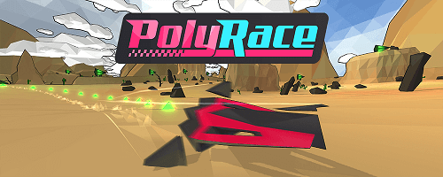

# Overview

PolyRace is a fast-paced futuristic racing game with a procedural level generator. Choose between 4 different hovercrafts with each of them having its own physic properties and a unique sci-fi hull. Run on generated terrains shaped with valleys, hills and mountains, mixing long straight lines and narrow curves while paying attention to your shield.

# Getting Started

This project contains all the sources code and assets of the game without the online part: race of the day, missions and challenge has been removed.

* Make sure you have Blender 3.0 installed for importing 3D assets.
* Import the project in Unity3D 2020.3.25f1. 
* Open the scene Scenes/Main_Scene and press the play button.

 # Credits

 * Game from [Vincent Themereau](https://twitter.com/vthemereau)
 * Racer 3D models from [Buryat Sky](https://buryat.me/)
 * SoundFx & Music from [Gabe Castro](https://twitter.com/gabejcastro)

 # License

The project is currently under the MIT [license](./License).

Third party code/assets:
 * [DoTween](http://dotween.demigiant.com/credits.php) [License](http://dotween.demigiant.com/license.php)
 * [LibNoise.Unity](https://github.com/ricardojmendez/LibNoise.Unity) [License](./Assets/Scripts/External/LibNoise.Unity/COPYING.LESSER.txt)
 * [MeshFragmentation](https://github.com/vthem/MeshFragmentation) [License](https://github.com/vthem/MeshFragmentation/blob/main/LICENSE)
 * Various scripts from [Keijiro Takahashi](https://github.com/keijiro/Reaktion)
 * Sprites from [Pixel perfect](https://www.flaticon.com/authors/pixel-perfect)
 * Font [Xolonium](https://fontlibrary.org/en/font/xolonium) [License](./Assets/Resources/Fonts/LICENSE.txt)
 * Various scripts from Scrawkblog, StackOverflow, Unity Forum...

 If you believe that your work has been published to this repository without permission, please contact me.
